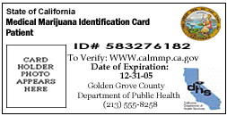

# Discussion

Create a [Rails API](https://api.rubyonrails.org/) backed web service for a dispensary that stores a customer's medical recommendations and state IDs. Additionally, create a ReactJS front end application to display the customer's medical recommendations and state IDs.

# Requirements

* The application should allow a user to create, update, or delete a state ID or medical recommendation.
* Store users' name, email address and date of birth.
* Store the medical recommendation number, issuer, state, expiration date and path to the image.
* Store the state ID number, state, expiration date and path to the image.
* If the state ID or medical recommendation is expired, make sure the application indicates that clearly.
* Display a card list of the users' medical recommendations and state IDs.
* Create both a mobile and desktop layout for the User's list view. Use similar styling for desktop as you see in the [/app/design-assets/mocks/styled-mobile.jpg](/app/design-assets/mocks/styled-mobile.jpg) mock.
* Clicking on a User card should expand the card to show the medical recommendations/state IDs for that user.

# Notes

### API
* This repository is bootstrapped with typical Rails6 API boilerplate to drive the backend of the application.
* You can find this boilerplate under `./api`. Please proceed to add your API logic, routes, etc under here.

### UI
* You will find a React boilerplate project under `./app`. Please create your UI, components, and styling under this here.
* All of the UI assets (logos, icons, fonts, etc) that you will need to style your views can be found in the `/app/design-assets` directory.
* You may include any additional packages (lodash, etc) that help you create your UI application
*  When styling your views, you may install any CSS-in-JS frameworks that you prefer, or you can use plain imported stylesheets.

### General
* We review the code challenges anonymously. Try not to include any identifying information in your commits.
* Use your normal development practices and git workflow, as if this were a production app. Please push any intermediate commits when you complete them.
* To make it easier for us to find the code you that you're writing, please try not to mix commits with generated code and code you've written yourself.
* We have not installed any test frameworks and leave that to you to implement however you see fit.
* In the initial commit message, include an estimate of how long you think it will take to complete the exercise (not including the bonus tasks). For example: `Initial commit - estimating x hours`
*  In the final commit message, include how long it took to complete the exercise. For example: `Make sure foo works properly - completed in y hours`
* We would like to focus on reviewing your application logic, so please be mindful and keep your commit history as clean as possible.

# Confirmation
* Ability to create, update, and delete a users' medical recommendations and state IDs.
* If the state ID or medical recommendation is expired, make sure that is clearly indicated.
* Create a view that displays the users' medical recommendations and state IDs
* Views must be styled like the mocks included in the `/design-assets/mocks` directory
* Views must be responsive for mobile and desktop screens
* Create a dev branch and create a pull request to master.

# Bonus
* Dockerize the application
* Deploy the application
* Create Create/Update/Delete UI that interacts with your Create/Update/Delete API endpoints
